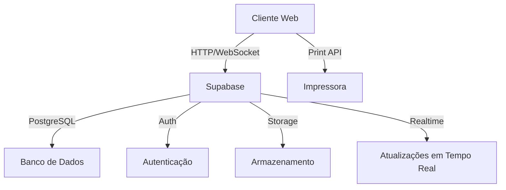
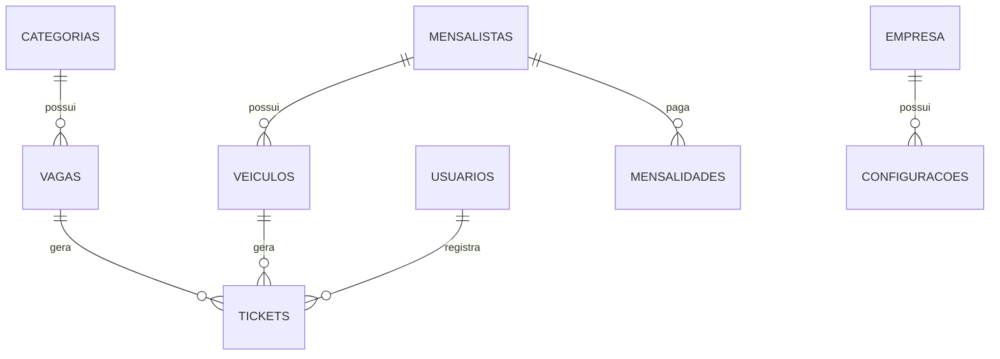
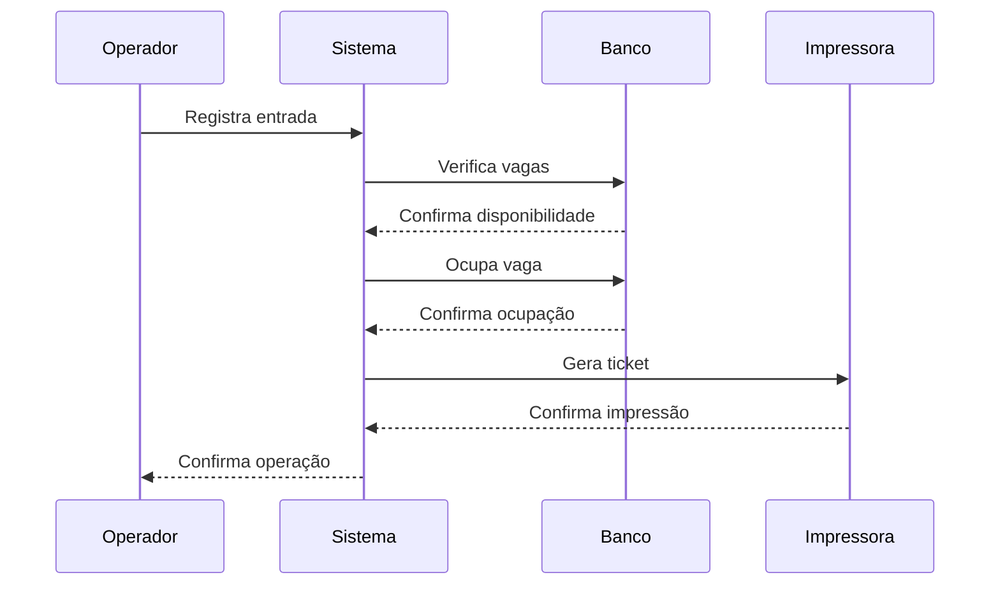
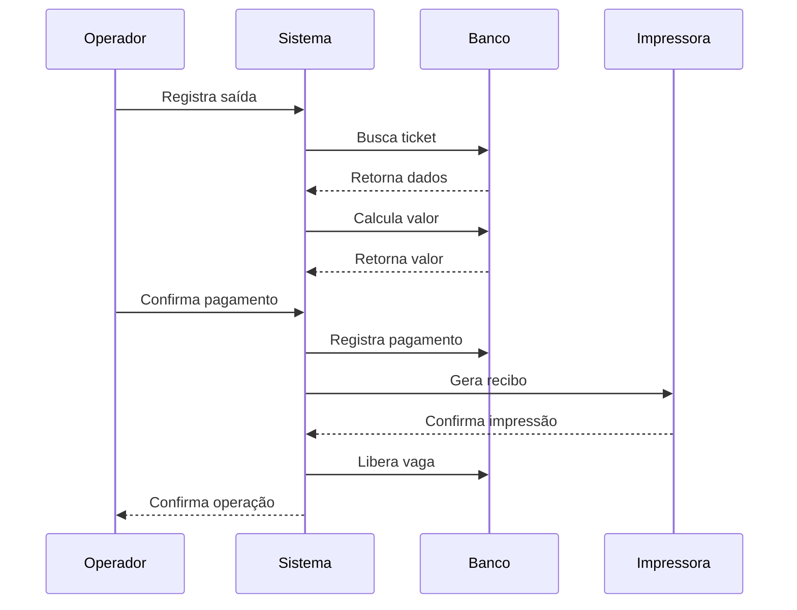
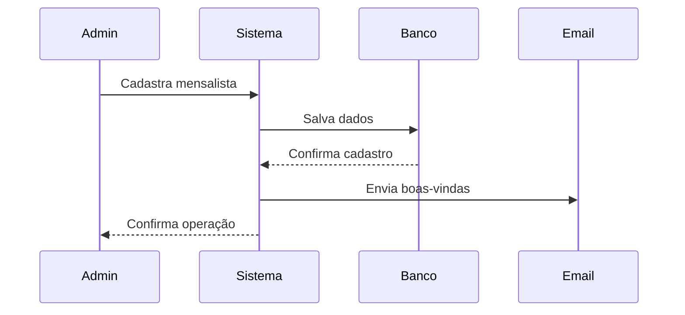

# Documentação Técnica - Sistema de Gerenciamento de Estacionamento

## Controle de Versão
| Versão | Data       | Autor        | Descrição das Alterações |
|--------|------------|--------------|-------------------------|
| 1.0    | 01/03/2024| Camilo Melo  | Versão inicial         |
| 1.1    | 15/03/2024| Camilo Melo  | Adição de novas funcionalidades |
| 1.2    | 26/03/2024| Camilo Melo  | Atualização da documentação técnica |

## Sumário Executivo
Este documento fornece uma visão técnica abrangente do Sistema de Gerenciamento de Estacionamento, incluindo sua arquitetura, componentes, funcionalidades e procedimentos operacionais.

## 1. Visão Geral do Sistema

### 1.1 Objetivo
O Sistema de Gerenciamento de Estacionamento é uma aplicação web desenvolvida para automatizar e otimizar a gestão de estacionamentos comerciais, oferecendo controle de vagas, gestão de mensalistas e geração de relatórios.

### 1.2 Escopo
- Gestão de vagas por categorias
- Controle de entrada/saída de veículos
- Gestão de mensalistas
- Emissão de tickets e recibos
- Relatórios gerenciais
- Painel de status em tempo real

### 1.3 Público-Alvo
- Operadores de estacionamento
- Administradores do sistema
- Clientes (visualização de status)

### 1.4 Funcionalidades Principais
1. **Gestão de Vagas**
   - Visualização em tempo real
   - Ocupação/liberação automática
   - Categorização por tipo de veículo

2. **Controle de Acesso**
   - Autenticação de usuários
   - Níveis de permissão
   - Registro de operações

3. **Gestão Financeira**
   - Controle de pagamentos
   - Relatórios de faturamento
   - Gestão de mensalidades

4. **Relatórios e Análises**
   - Ocupação por período
   - Faturamento detalhado
   - Análise de rotatividade

## 2. Arquitetura do Sistema

### 2.1 Visão Geral da Arquitetura


### 2.2 Componentes do Sistema
- **Frontend**: 
  - Single Page Application (SPA) em React
  - TypeScript para type safety
  - Ant Design para componentes UI
  - CSS Modules para estilos

- **Backend**: 
  - Supabase (BaaS)
  - PostgreSQL com funções PL/pgSQL
  - Realtime subscriptions
  - Row Level Security (RLS)

- **Banco de Dados**: 
  - PostgreSQL 14+
  - Schemas organizados
  - Triggers e funções
  - Backup automatizado

- **Cache**: 
  - Local Storage
  - Session Storage
  - React Query cache

- **API**: 
  - RESTful
  - WebSocket
  - Supabase Client
  - Tratamento de erros

### 2.3 Requisitos Técnicos
- **Ambiente de Desenvolvimento**:
  - Node.js 16+
  - NPM 8+
  - Git
  - VS Code (recomendado)
  - ESLint + Prettier

- **Ambiente de Produção**:
  - Servidor Web (Nginx recomendado)
  - SSL/TLS
  - Supabase Cloud
  - CDN (opcional)

- **Requisitos de Cliente**:
  - Navegadores modernos (Chrome 90+, Firefox 90+, Safari 14+)
  - Conexão com internet estável (mínimo 1Mbps)
  - Impressora térmica compatível (para tickets)
  - Resolução mínima: 1280x720

### 2.4 Integrações
1. **Impressora**
   - Protocolo: ESC/POS
   - Conexão: USB/Network
   - Drivers necessários

2. **Supabase**
   - API Key
   - Configurações de projeto
   - Políticas de segurança

3. **Serviços de Email**
   - SMTP configurado
   - Templates HTML
   - Fila de envio

## 3. Estrutura do Projeto

### 3.1 Organização de Diretórios
```
estacionamento-app/
├── src/
│   ├── components/        # Componentes React reutilizáveis
│   │   ├── Layout/       # Estrutura base da aplicação
│   │   ├── Sidebar/      # Menu de navegação
│   │   └── shared/       # Componentes compartilhados
│   ├── contexts/         # Contextos React
│   │   ├── AuthContext/  # Gestão de autenticação
│   │   └── ThemeContext/ # Gestão de tema
│   ├── pages/           # Páginas da aplicação
│   │   ├── Dashboard/   # Painel principal
│   │   ├── Vagas/      # Gestão de vagas
│   │   └── Relatorios/ # Relatórios
│   ├── services/        # Serviços e integrações
│   │   ├── api/        # Chamadas de API
│   │   └── print/      # Serviços de impressão
│   ├── styles/          # Estilos globais
│   ├── types/           # Definições TypeScript
│   └── utils/           # Funções utilitárias
├── supabase/
│   ├── migrations/      # Migrações do banco
│   └── functions/      # Edge Functions
├── public/             # Arquivos estáticos
└── docs/               # Documentação
```

### 3.2 Padrões de Código
- **Nomenclatura**: 
  - PascalCase: Componentes React
  - camelCase: Funções e variáveis
  - UPPER_CASE: Constantes
  - kebab-case: Arquivos CSS

- **Tipagem**: 
  - TypeScript strict mode
  - Interfaces para props
  - Types para estados
  - Enums para constantes

- **Estilo**: 
  - ESLint configuração extendida
  - Prettier com regras personalizadas
  - EditorConfig

- **Commits**: 
  - Conventional Commits
  - Prefixos: feat, fix, docs, style, refactor
  - Mensagens descritivas em inglês

### 3.3 Convenções de Código
```typescript
// Exemplo de componente
interface Props {
  title: string;
  onAction: () => void;
}

const Component: React.FC<Props> = ({ title, onAction }) => {
  // Implementação
};

// Exemplo de hook
const useCustomHook = (param: string): Result => {
  // Implementação
};

// Exemplo de serviço
class Service {
  private readonly baseUrl: string;
  
  constructor(config: Config) {
    // Implementação
  }
}
```

## 4. Modelo de Dados

### 4.1 Diagrama ER Completo


### 4.2 Tabelas Principais

#### 4.2.1 categorias
| Campo      | Tipo    | Descrição                | Restrições |
|------------|---------|--------------------------|------------|
| id         | UUID    | Identificador único      | PK         |
| nome       | VARCHAR | Nome da categoria        | NOT NULL   |
| preco_hora | DECIMAL | Preço por hora          | NOT NULL   |
| preco_dia  | DECIMAL | Preço da diária         | NOT NULL   |
| preco_mes  | DECIMAL | Preço mensal            | NOT NULL   |
| vagas      | INTEGER | Quantidade total de vagas| NOT NULL   |
| created_at | TIMESTAMP| Data de criação        | NOT NULL   |
| updated_at | TIMESTAMP| Data de atualização    | NOT NULL   |

#### 4.2.2 vagas
| Campo        | Tipo    | Descrição           | Restrições |
|--------------|---------|---------------------|------------|
| id           | UUID    | Identificador único | PK         |
| numero       | VARCHAR | Número da vaga      | NOT NULL   |
| status       | ENUM    | Status atual        | NOT NULL   |
| categoria_id | UUID    | Categoria da vaga   | FK         |
| placa        | VARCHAR | Placa do veículo    | NULL      |
| hora_entrada | TIMESTAMP| Hora de entrada    | NULL      |
| created_at   | TIMESTAMP| Data de criação    | NOT NULL   |
| updated_at   | TIMESTAMP| Data de atualização| NOT NULL   |

#### 4.2.3 tickets
| Campo          | Tipo    | Descrição           | Restrições |
|----------------|---------|---------------------|------------|
| id             | UUID    | Identificador único | PK         |
| vaga_id        | UUID    | ID da vaga         | FK         |
| placa          | VARCHAR | Placa do veículo    | NOT NULL   |
| hora_entrada   | TIMESTAMP| Hora de entrada    | NOT NULL   |
| hora_saida     | TIMESTAMP| Hora de saída      | NULL      |
| valor_cobrado  | DECIMAL | Valor total         | NULL      |
| tipo           | ENUM    | Tipo do ticket      | NOT NULL   |
| status         | ENUM    | Status do ticket    | NOT NULL   |
| created_at     | TIMESTAMP| Data de criação    | NOT NULL   |
| updated_at     | TIMESTAMP| Data de atualização| NOT NULL   |

### 4.3 Funções do Banco de Dados

#### 4.3.1 ocupar_vaga()
```sql
FUNCTION ocupar_vaga(
    p_vaga_id UUID,
    p_placa VARCHAR,
    p_hora_entrada TIMESTAMP,
    p_tipo VARCHAR DEFAULT 'AVULSO'
) RETURNS JSONB
```
**Descrição**: Realiza a ocupação atômica de uma vaga
**Parâmetros**:
- p_vaga_id: ID da vaga a ser ocupada
- p_placa: Placa do veículo
- p_hora_entrada: Timestamp da entrada
- p_tipo: Tipo de ocupação (AVULSO/MENSALISTA)

**Retorno**: Dados da vaga atualizada
**Tratamento de Erros**: 
- Vaga não encontrada
- Vaga já ocupada
- Limite de categoria excedido
- Erro de concorrência

#### 4.3.2 calcular_valor()
```sql
FUNCTION calcular_valor(
    p_ticket_id UUID,
    p_hora_saida TIMESTAMP
) RETURNS DECIMAL
```
**Descrição**: Calcula o valor a ser cobrado
**Lógica de Negócio**:
- Cálculo por hora/fração
- Aplicação de descontos
- Tarifas especiais
- Tolerância configurável

## 5. Interfaces e Componentes

### 5.1 Componentes Principais

#### 5.1.1 Layout
```typescript
interface LayoutProps {
  children: React.ReactNode;
  showSidebar?: boolean;
  pageTitle?: string;
  loading?: boolean;
}
```
**Responsabilidades**:
- Estruturação do layout base
- Gerenciamento do sidebar
- Responsividade
- Loading states
- Breadcrumbs
- Notificações

#### 5.1.2 ImprimirTicket
```typescript
interface ImprimirTicketProps {
  ticket: TicketData;
  empresa: EmpresaData;
  onSuccess?: () => void;
  onError?: (error: Error) => void;
  template?: 'entrada' | 'saida' | 'mensalista';
  copias?: number;
}

interface TicketData {
  id: string;
  placa: string;
  modelo?: string;
  cor?: string;
  hora_entrada: Date;
  hora_saida?: Date;
  valor?: number;
  vaga: string;
  tipo: 'AVULSO' | 'MENSALISTA';
}

interface EmpresaData {
  nome: string;
  endereco: string;
  telefone: string;
  cnpj: string;
  logo?: string;
}
```
**Funcionalidades**:
- Formatação do ticket
- Integração com impressora
- Tratamento de erros de impressão
- Templates personalizáveis
- Múltiplas cópias
- Logo da empresa
- QR Code

### 5.2 Hooks Personalizados

#### 5.2.1 useVagas
```typescript
const useVagas = (categoriaId?: string) => {
  const [vagas, setVagas] = useState<Vaga[]>([]);
  const [loading, setLoading] = useState(true);
  const [error, setError] = useState<Error | null>(null);
  
  // Implementação
};
```

#### 5.2.2 useTicket
```typescript
const useTicket = (ticketId: string) => {
  const [ticket, setTicket] = useState<Ticket | null>(null);
  const [loading, setLoading] = useState(true);
  const [error, setError] = useState<Error | null>(null);
  
  // Implementação
};
```

## 6. Fluxos de Processo

### 6.1 Entrada de Veículo


### 6.2 Saída de Veículo


### 6.3 Gestão de Mensalista


## 7. Segurança

### 7.1 Autenticação
- JWT com refresh token
- Sessão persistente
- Proteção contra CSRF
- Rate limiting
- Bloqueio após tentativas
- Recuperação de senha
- 2FA (opcional)

### 7.2 Autorização
```typescript
enum UserRole {
  ADMIN = 'ADMIN',
  OPERATOR = 'OPERATOR',
  PUBLIC = 'PUBLIC'
}

interface User {
  id: string;
  email: string;
  role: UserRole;
  permissions: string[];
  lastLogin: Date;
  status: 'ACTIVE' | 'INACTIVE';
}
```

### 7.3 Políticas de Acesso
| Recurso           | Público | Operador | Admin |
|-------------------|---------|----------|-------|
| Ver vagas         | ✓       | ✓        | ✓     |
| Tickets           | ✗       | ✓        | ✓     |
| Relatórios        | ✗       | ✗        | ✓     |
| Configurações     | ✗       | ✗        | ✓     |
| Mensalistas       | ✗       | ✓        | ✓     |
| Usuários          | ✗       | ✗        | ✓     |
| Dados da Empresa  | ✗       | ✗        | ✓     |

### 7.4 Segurança de Dados
- Criptografia em trânsito (HTTPS)
- Criptografia em repouso
- Mascaramento de dados sensíveis
- Política de senhas fortes
- Logs de auditoria
- Backup criptografado

## 8. Monitoramento e Logs

### 8.1 Logs do Sistema
```typescript
interface SystemLog {
  id: string;
  level: 'INFO' | 'WARN' | 'ERROR';
  message: string;
  timestamp: Date;
  user?: string;
  action?: string;
  details?: Record<string, unknown>;
  ip?: string;
  userAgent?: string;
}

interface ErrorLog extends SystemLog {
  error: {
    name: string;
    message: string;
    stack?: string;
  };
  context?: Record<string, unknown>;
}
```

### 8.2 Métricas
- **Performance**:
  - Tempo de resposta das operações
  - Latência de banco de dados
  - Tempo de renderização
  - Cache hits/misses

- **Negócio**:
  - Taxa de ocupação por categoria
  - Tempo médio de permanência
  - Faturamento por período
  - Tickets por hora

- **Técnicas**:
  - Erros por tipo
  - Uso de memória
  - Performance do cliente
  - Tempo de carregamento

### 8.3 Alertas
- Ocupação crítica
- Erros frequentes
- Performance degradada
- Tentativas de invasão

## 9. Procedimentos Operacionais

### 9.1 Deploy
1. Build de produção
   ```bash
   npm run build
   ```
2. Testes automatizados
   ```bash
   npm run test
   npm run e2e
   ```
3. Deploy no ambiente de produção
   ```bash
   npm run deploy
   ```
4. Verificação pós-deploy
   - Healthcheck
   - Smoke tests
   - Monitoramento inicial

### 9.2 Backup
- **Banco de Dados**:
  - Backup diário às 00:00
  - Retenção de 30 dias
  - Verificação de integridade
  - Restore teste mensal

- **Arquivos**:
  - Backup incremental
  - Logs
  - Configurações
  - Documentos

### 9.3 Manutenção
- **Janela de Manutenção**: 
  - Domingos 02:00-04:00
  - Notificação prévia
  - Plano de rollback

- **Atualizações**:
  - Patches de segurança
  - Atualizações de dependências
  - Migrations de banco
  - Documentação

### 9.4 Recuperação de Desastres
1. **Cenários**:
   - Falha de servidor
   - Corrupção de dados
   - Ataque cibernético
   - Perda de conectividade

2. **Procedimentos**:
   - Ativação de contingência
   - Restore de backup
   - Comunicação
   - Pós-mortem

## 10. Suporte e Contato

### 10.1 Equipe Responsável
- **Desenvolvimento**: 
  - Camilo Melo (camilomelo8428@gmail.com)
  - Horário: 9h-18h (GMT-3)
  - Slack: @camilomelo

- **Suporte N1**: 
  - [Nome do Responsável]
  - Horário: 24/7
  - Tel: [Número]

- **Suporte N2**: 
  - [Nome do Responsável]
  - Horário: 8h-20h
  - Email: [Email]

### 10.2 Procedimentos de Suporte
1. **Abertura de Chamado**:
   - Portal de suporte
   - Email
   - Telefone

2. **Classificação de Severidade**:
   - S1: Sistema indisponível
   - S2: Funcionalidade crítica
   - S3: Problema pontual
   - S4: Dúvida/Melhoria

3. **SLA por Severidade**:
   | Severidade | Primeira Resposta | Resolução |
   |------------|-------------------|-----------|
   | S1         | 15 minutos       | 2 horas   |
   | S2         | 30 minutos       | 4 horas   |
   | S3         | 2 horas          | 24 horas  |
   | S4         | 4 horas          | 72 horas  |

4. **Escalonamento**:
   - N1 -> N2: Após 30 min sem solução
   - N2 -> Dev: Problemas técnicos
   - Dev -> Admin: Decisões críticas

## 11. Anexos

### 11.1 Glossário
- **Ticket**: Comprovante de entrada/saída
- **Mensalista**: Cliente com contrato mensal
- **Vaga**: Espaço físico para estacionamento
- **Avulso**: Cliente sem contrato
- **Diária**: Período de 24h
- **Fração**: Período mínimo de cobrança
- **Tolerância**: Tempo sem cobrança

### 11.2 Referências
- [Documentação React](https://reactjs.org)
- [Documentação Supabase](https://supabase.io/docs)
- [Ant Design](https://ant.design)
- [TypeScript](https://www.typescriptlang.org/docs)
- [PostgreSQL](https://www.postgresql.org/docs)

### 11.3 Histórico de Alterações
| Data       | Versão | Alteração | Autor |
|------------|--------|-----------|-------|
| 01/03/2024 | 1.0   | Criação   | CM    |
| 15/03/2024 | 1.1   | Funções   | CM    |
| 26/03/2024 | 1.2   | Revisão   | CM    |

---

*Documento mantido por: Equipe de Desenvolvimento*  
*Última atualização: Março 2024*  
*Revisão programada: Junho 2024*  
*Contato: suporte@estacionamento.com* 